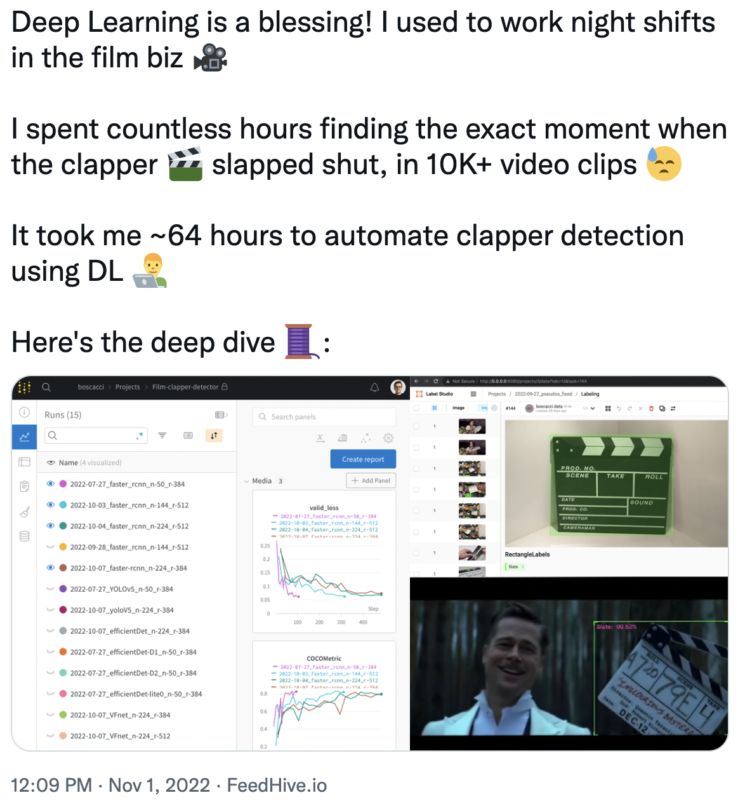
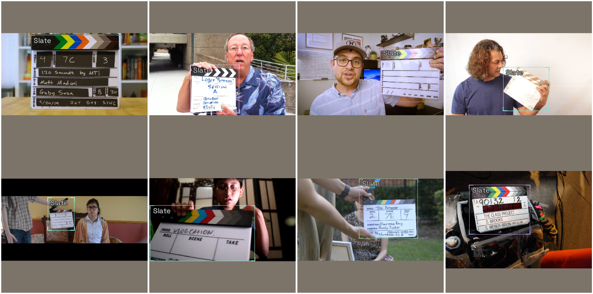

# Film Slate Detector
    
    My first computer vision object detection project

Click the preview image below to read the explainer tweet thread:
***

***
    
Training notebook: [/notebooks/Training.ipynb](https://github.com/boscacci/film-slate-detector/blob/main/notebooks/Training.ipynb)

Prediction notebook: [notebooks/Inference.ipynb](https://github.com/boscacci/film-slate-detector/blob/main/notebooks/Inference.ipynb)

***
Images labled in Heartex LabelStudio:

